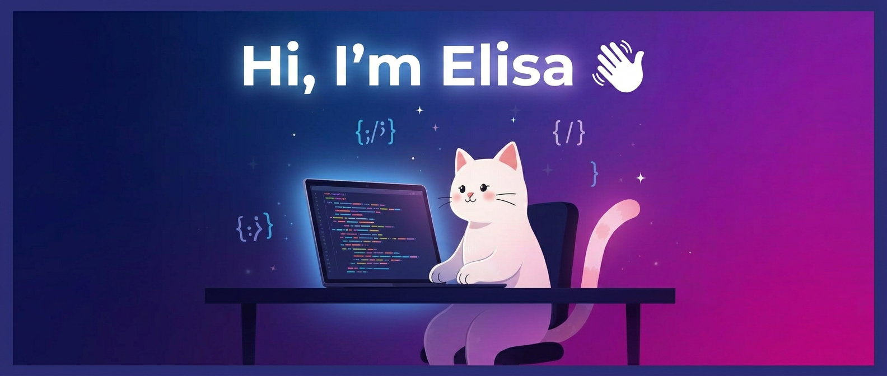

  

<h1 align="center">Hi, I'm Elisa!</h1>

  CS Student @ Queen's University

  
  
  

## About Me 💗

I'm a third-year CS student at Queen's University who loves all things technology! I like learning about data, ML, security, and software development. I'm constantly coming up with new project ideas, I've participated in multiple hackathons, and enjoy the thrill of building more than anything.

In my free time, I love going to the gym, hiking, and boxing. I've also been a huge video game enthusiast since I was younger. My favorite games are story-driven titles, but I've also played competitively in games like Call of Duty, Valorant, and more.

## Tech Stack 🛠️

### Languages

  
  

### AI / ML

  
  
  
  
  
  
  
  

### Developer Technologies

  

### Libraries / Frameworks

  

## Featured Projects 🚀

| Project | Description | Stack |
| --- | --- | --- |
| 🤖 Study Buddy AI | An AI study platform that turns user-uploaded files into personalized flashcards and quizzes. | Next.js · AWS · Firebase · Anthropic API |
| 📈 Forecastr | Stock prediction web app fusing market data and NLP for short-term price direction with confidence scores. | FastAPI · scikit-learn · Next.js · Supabase · BERT |
| 🍽️ Tamsactions | Marketplace for Queen's students to buy and sell meal credits with secure auth and Stripe payments. | TypeScript · React · Firebase · Stripe |

## GitHub Stats 📊

  
  

  

## Let's Connect 📫

  <a href="mailto:elisareine.a.goncalves@gmail.com">elisareine.a.goncalves@gmail.com</a>

